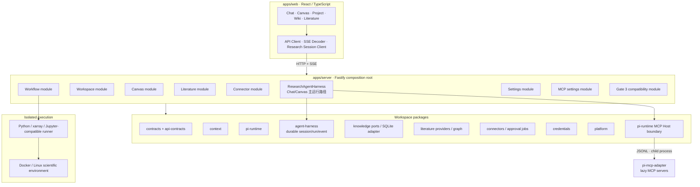
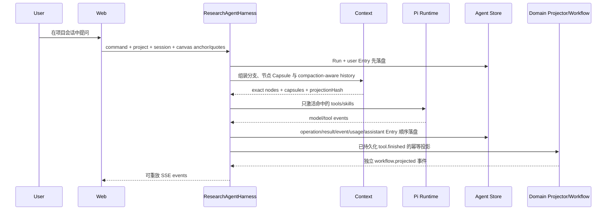

# 汐灵 OS 设计文档

> 本文档是汐灵 OS 当前产品与软件架构的首要入口（living design document）。
>
> - 状态：有效
> - 最后核对：2026-08-25
> - 对应版本：Gate 1–4 功能闭环、Gate 4.5 Agent 中枢纠偏已完成并确认、隔离 Pi MCP Host 已接入、Gate 5 暂停
> - 代码事实源：`packages/contracts`、`packages/api-contracts` 与各模块的公开接口

## 1. 产品目标

汐灵 OS 是面向个人物理海洋与气候研究者的本地优先 AI 科研工作台。它要把以下过程组织成一个可审批、可追踪、可恢复的研究闭环：

```text
科研问题 → 文献证据 → 数据检索/切片 → 隔离计算 → 图表与报告
        → Reviewer 审查 → Artifact/溯源 → 项目、画布与 Wiki 沉淀
```

首版围绕 Python 物理海洋与气候研究，不以通用办公 Agent、团队协作平台或云端多租户系统为目标。

产品的五个主要工作面不是五套独立数据：

| 工作面 | 主要职责 | 共享对象 |
|---|---|---|
| Chat | 提问、分解任务、工具调用、审批入口 | Project、AgentSession、Canvas context、Workflow |
| 科研画布 | 表达问题、回答、证据、数据、运行与推理分支 | CanvasGraph、Paper、Workflow、Artifact |
| 项目 | 目标、事项、实验与科研闭环状态 | Project、ProjectItem、Workflow |
| Wiki | 像浏览百科一样理解项目并定位结论和产物 | WikiPage、Evidence、Artifact、ProjectItem |
| 文献图 | 探索引用、推荐、共被引和书目耦合 | Paper、CitationEdge、Evidence |

## 2. 设计原则

1. **本地优先**：项目元数据和凭据默认保存在本机；科研执行进入受控容器。
2. **开源优先**：先复用成熟库、协议和格式，自研模块必须有稳定替换边界和 smoke。
3. **审批优先**：下载、计算和外部写入必须先形成可读计划并等待用户确认。
4. **证据优先**：摘要和模型输出不是证据；结论必须回链到论文、数据或 Artifact。
5. **天然节省上下文**：依靠上下文拓扑、按需能力、内容寻址、缓存和结构化交接减少重复，而不是为正常科研任务强行设置统一 token 上限。
6. **模块化单体**：在确有独立扩缩容或故障隔离需求前，不用微服务增加本地安装成本。
7. **跨平台边界清晰**：macOS/Linux 直接运行；Windows 11 使用原生启动层 + WSL2 Linux 后端。

## 3. 总体架构



部署细节见 [三平台部署设计](docs/architecture/deployment.md)，模块边界的完整说明见 [模块化单体架构](docs/architecture/modular-monolith.md)。

正式 Chat/Canvas 统一使用 `/api/agent-center/*`：Server 先建立耐久 Run 与用户 Entry，再执行 Pi Runtime，并以可续传事件流暴露进度。旧 `/api/chat/stream` 与旧消息 POST 已删除；Knowledge 的旧消息表只作为迁移读取源。详见 [Agent 中枢架构纠偏 Gate](docs/gate-4.5-agent-center-correction.md)。

## 4. 仓库结构与所有权

```text
apps/
├── web/                         # UI、视图状态、HTTP/SSE 客户端
└── server/                      # 组合根、模块路由、应用级编排
    └── src/modules/
        ├── canvas/              # Canvas Repository、revision、布局 API
        ├── connectors/          # 元数据、审批任务、下载与 Artifact API
        ├── literature/          # 搜索、证据、论文固定到画布
        ├── workflows/           # 项目科研闭环 HTTP API
        ├── workspace/           # Project、事项、Chat 历史、Wiki
        ├── settings/            # 凭据状态、模型路由、自定义 Provider
        ├── mcp/                 # MCP 配置、密钥状态、连通性测试
        ├── agent-center/        # 正式 command/snapshot/event/source API
        └── legacy-gate3/        # 旧 API 兼容；禁止新增能力
packages/
├── contracts/                   # 领域 TypeScript 类型事实源
├── api-contracts/               # 前后端共享 Zod 运行时契约
├── context/                     # 投影、Capsule、组装、缓存与 token 估算
├── pi-runtime/                  # Pi SDK 适配、模型路由、Skill、MCP Host、TokenLedger
├── agent-harness/               # Pi 无关的耐久 Agent 运行中枢
├── knowledge/                   # Knowledge ports、SQLite 适配与迁移
├── literature/                  # 文献 Provider、缓存和图算法
├── connectors/                  # 数据连接器契约、预检、审批状态机
├── credentials/                 # 加密凭据存储
├── platform/                    # Windows/WSL 与路径适配
└── research/                    # Gate 3 兼容聚合；禁止继续扩展
services/runner/                 # Python 科学计算与容器执行
scripts/                         # smoke、架构、合规和跨平台检查
docs/adr/                        # 已接受或被替代的架构决策
```

### 4.1 依赖方向

- `contracts` 不依赖其他领域包。
- `api-contracts` 只依赖 `contracts` 和运行时校验库。
- 领域包不得依赖 `apps/*`。
- Web 不得导入 Server 实现。
- Server 是组合根，可以装配领域包；模块之间优先依赖 port/interface。
- 新依赖必须通过 `pnpm architecture`。

依赖方向由 `scripts/architecture-check.mjs` 自动检查。不能仅为了让检查通过而扩大允许列表；改变方向必须先写 ADR。

## 5. 核心领域对象与数据所有权

`packages/contracts/src/index.ts` 是字段和联合类型的唯一事实源。本文只记录所有权，不复制完整接口。

| 对象 | 当前所有者 | 持久化 | 关键约束 |
|---|---|---|---|
| Project / ProjectItem | Knowledge | SQLite | 所有研究对象必须属于 Project |
| ChatSession 目录 | Knowledge | SQLite | 会话必须项目隔离 |
| Agent Entry / Message | Agent Harness | Agent SQLite | Server 单写；Canvas 以 `sourceEntryId` 引用完整原文 |
| WikiPage / Revision | Knowledge | SQLite + FTS5 | Revision 不可变；恢复产生新版本 |
| Evidence | Knowledge | SQLite | 按 project + paper 去重 |
| ContextCapsule | Context + Knowledge | SQLite 派生缓存 | 不是证据源；源变化后失效 |
| CanvasGraphDocument | Canvas Repository | 项目级 JSON 文档 | 单调 revision、乐观并发、原子替换 |
| Paper / LiteratureGraph | Literature | Provider cache + Evidence | Provider 结果归一化为 PaperRecord |
| ConnectorJob | Connectors | JSON repository | 未审批不得下载；计划与来源哈希绑定 |
| ProjectResearchWorkflow | Workflow | JSON repository | 新科研闭环的唯一状态机 |
| Artifact / RO-Crate | Runner / Artifact storage | 文件系统 | 大 payload 不进入 SQLite 或模型上下文 |
| Credential | Credentials | 加密文件 | 密钥不回传 UI、不进入日志/上下文 |
| TokenLedger | Pi Runtime | JSONL | 用于观测，不作为正常任务硬限额 |
| McpServerSettings | MCP Settings + Credentials | JSON + 加密凭据文件 | Server 配置不含密钥；完整工具目录留在隔离 Host |
| AgentSession / Run / Operation / Entry / Usage / Compaction | Agent Harness | 独立 SQLite | Gate 4.5-D 已成为 Chat/Canvas 主事实源 |

业务数据库不持久化任意操作系统绝对路径。跨平台资源使用 `project://`、`artifact://`、`dataset://` URI。

## 6. 关键运行流程

### 6.1 Chat 与上下文

以下时序描述当前正式链路。Web 只发命令、订阅事件并刷新领域投影，不拥有 Agent 或 Workflow 写入事实。



重要约束：

- 默认只读取当前活动节点的祖先分支和显式 Quote 节点。
- 兄弟分支不会因为“都在同一画布”而自动进入上下文。
- Skill 常驻部分只有索引；正文只在命中时装载。
- 工具 schema 只为本轮相关能力激活。
- PDF、NetCDF、完整日志和图像 payload 只以 Artifact URI 流动。
- Context Assembler 根据模型窗口做可解释的语义降级；不得静默截断证据。
- Agent Store 保存 Run、Operation、Entry、Usage、Compaction 和事件游标；重连按序号重放。
- 自动 Compaction 保留覆盖范围、来源哈希和 retained tail；原 Entry 不删除。
- MCP 只在宿主元数据命中任务后增加一个固定代理工具；Server 与具体工具 schema 不进入 Agent 主上下文。

当前不变量：

- `ResearchAgentHarness` 是 Agent loop、会话条目、工具调用、压缩检查点和取消状态的唯一协调入口。
- Durable Agent Session Store 是 Agent 历史真相源；Web 端只发命令、订阅事件和保存纯展示偏好。
- Project/Wiki/Evidence、Canvas、Artifact 仍由各自仓储拥有，Agent 只通过显式 projector 写入这些领域对象。
- 画布节点保存 `sourceEntryId`/`artifactId` 等引用，不再以截断文本冒充完整上下文。
- `SourceContentResolver` 根据 source kind 在项目权限和读取上限内解析 Agent Entry、Paper/Evidence、Workflow、Artifact 或自由笔记；Context Pipeline 不猜测展示文本的来源。
- Canvas 与 Pi Session Tree 不做 1:1 映射；移动、布局、手工连线与删除投影不改变追加式执行事实。
- Agent 生成的 Wiki 草稿必须携带 source/run/evidence 溯源，发布继续经过用户确认。

详细机制见 [上下文经济架构](docs/architecture/context-budget.md)。MCP 已通过独立 Host 接入：无配置时不启动子进程，任务未命中时不激活代理工具，具体工具 schema 由 adapter 缓存并按 search/describe 获取。

### 6.2 项目科研闭环

当前唯一主状态机是 `ProjectWorkflowService`：

```text
draft → probing → pending_approval → approved
      → downloading → analyzing → completed
```

并支持 `rejected`、`failed`、`cancelled` 和显式 `reset`。

1. Agent 只能生成经过 schema 验证的数据切片计划。
2. 元数据探测返回变量、范围、预计体积和目标，不执行下载。
3. 用户批准当前哈希对应的计划。
4. Connector 下载受批准的数据，Runner 在隔离容器中分析。
5. Reviewer 检查结果与限制，Runner 生成 Artifact 和 RO-Crate。
6. settlement 幂等写入实验事项、Wiki 与 Canvas，再标记 Workflow 已沉淀。

Gate 3 路由只为旧数据和旧测试保留，不得成为新功能入口。

### 6.3 Canvas

- 节点的位置是用户可编辑布局；边表达上下文/溯源关系，不只是视觉连线。
- `follow-up`：对话或推理的父子关系。
- `quote`：显式引用论文或另一分支。
- `produced`：数据/Workflow 产生运行或 Artifact。
- `checkpoint`：阶段性 Agent 检查点。
- 除 `quote` 外，结构边必须保持无环。
- 每次保存携带客户端读到的 revision；过期写入返回 409，不允许最后写入者静默覆盖。
- Repository 对同一项目串行写入，并以临时文件 + rename 原子替换。
- Agent 未来生成 Canvas Patch 时仍必须先预览、再确认；当前 revision 不是完整的 Patch 历史。

### 6.4 Wiki

Wiki 的目的不是独立笔记编辑器，而是项目的百科入口：用户应能从项目概述逐层定位研究问题、方法、数据、证据、实验、结论、限制、图表、工具和 Artifact。

- 页面属于 Project，正文使用 Markdown。
- 修订不可变，恢复旧版本会创建新 revision。
- `[[slug]]` 建立站内链接和反向链接。
- Artifact 只嵌入 URI/查看器，不复制二进制内容。
- Agent 默认产生草稿或差异，不应直接覆盖用户正式内容。

## 7. API 与前端基础设施

- HTTP 输入由 `@xiling/api-contracts` 校验；修改请求字段时前后端必须在同一变更中升级。
- `apps/web/src/lib/api-client.ts` 是 JSON 请求和 API 错误的统一入口。
- `apps/web/src/lib/agent-stream.ts` 是 SSE 解码的统一入口。
- `apps/web/src/lib/research-session-client.ts` 只负责发送 Agent command、订阅耐久事件和触发取消；消息、Run 与工具→Workflow 投影均由 Server 拥有。
- 视图组件不得重新实现 fetch、SSE parser 或 Workflow 协议。
- 禁止向 `research-session-client.ts` 增加 Agent 持久化或领域写入职责。
- 当前旧路由的错误 body 尚未完全统一；新增 API 应返回 `{ error, code?, details? }`，后续会以兼容方式统一旧接口。

## 8. 模型、Skill 与 MCP

### 模型

- 用户可输入任意模型 ID；推荐目录只是便利选项，不是白名单。
- 原生输入/输出模态属于模型，而不是 Provider。
- 模型不支持某模态时，界面直接禁用；不得用非原生转换伪装支持。
- 自定义 Provider 当前支持显式 Base URL 和 API 风格边界。
- 连通性测试只发送最小测试请求，不把项目数据带出系统。

### Skill

- `skills/` 中的目录由宿主索引。
- 初始上下文只包含名称、描述、版本和 capability IDs。
- 任务命中后才读取正文，并只激活关联工具。
- 设置页通过 `/api/settings/skills` 可视化已安装目录、触发词和 Capability→工具映射；接口不返回相对路径或 `SKILL.md` 正文，打开设置不会触发 Skill 加载。
- 当前 Skill 目录由仓库 `skills/catalog.json` 管理；设置页提供只读检查和刷新，不伪装尚未实现的安装、禁用或版本升级操作。
- Pi Package 将按资源分级兼容：Skill/Prompt 可审计导入，Tool Extension 必须经受限 API 与隔离执行，TUI/Theme/Coding Command 不兼容；当前尚未实现安装器。
- Pi 升级只允许通过 `@xiling/pi-runtime` 适配边界，core/ai 同版本精确锁定并运行 `pnpm pi:compat`。

### MCP

- 设置页管理 HTTP/stdio Server、用途关键词、none/Bearer/OAuth 鉴权、启停、信任级别与连通性测试。
- Bearer Token 进入 AES-256-GCM 凭据库；JSON 配置和浏览器 API 只保存/返回配置状态。
- `pi-mcp-adapter` 与 `pi-coding-agent` 只运行在 `@xiling/pi-runtime` 管理的独立子进程；Server 通过 JSONL port 调用，不加载任意 Extension。
- Host 不扫描 Cursor、Claude、Codex 或用户 Pi 配置；外部 stdio 进程使用 `shell: false`，Windows 在 WSL2 后端执行。
- Agent 常规轮次没有 MCP schema。任务命中 Server 名称、用途或关键词后，只激活一个固定 `mcp` 代理工具；具体 schema 通过 search/describe 按需读取。
- 默认只允许发现和测试；实际工具调用由 adapter 硬性要求审批。用户显式信任某个 Server 才解除该拦截。
- 输出有字节、行数和 details 上限；长结果应进入 Artifact。Host 失败不会阻断没有使用 MCP 的 Chat、Canvas、Wiki 或项目功能。

当前已知边界：通用 Pi Package 安装器仍未实现；OAuth 授权动作由 adapter 按需处理；trusted 是用户对单个 Server 的显式高权限选择，不等同于取消汐灵对下载、计算和外部写入的领域审批规则。

## 9. 安全与执行边界

- 服务默认只绑定 `127.0.0.1`。
- 科研代码和官方客户端在非 root、有限 CPU/内存的 Linux 容器中运行。
- 凭据通过受控通道注入单次运行，不进入 argv、Artifact、计划 JSON 或模型上下文。
- MCP Bearer Token 只在隔离 Host 配置时读取，不回传 Web；默认 Server 工具调用需审批。
- 下载审批锁定请求哈希、元数据来源哈希、变量、区域、时间、深度、体积和目标。
- 取消使用应用 cancellation token、Pi `abort()`、Jupyter interrupt 或 Docker stop/kill 升级路径，不依赖 POSIX 信号语义。
- 受管 Artifact 读取必须校验 URI、扩展名、路径穿越和最大读取量。

## 10. Windows 兼容策略

- 正式支持 Windows 11 x86_64，后端运行于独立 WSL2 环境。
- SQLite、Git、`node_modules`、Python 环境和活动科研数据位于 WSL ext4。
- NTFS/OneDrive 文件先预检并导入项目存储，分析期间不直接在 `/mnt/c` 高频随机读写。
- PowerShell 负责 Doctor、启动、停止、路径导入和浏览器打开，不承载科研业务逻辑。
- 文本统一 UTF-8/LF；Shell 与 PowerShell 分别有入口。
- Windows 11 + WSL2 + Docker Desktop 的完整发布验证必须在真实专机执行，不能由普通 GitHub Runner 的嵌套虚拟化替代。

## 11. 持久化、一致性与恢复

### SQLite

- `KnowledgeService` 是当前 SQLite 适配器，调用方依赖 `ProjectStore`、`ConversationStore`、`WikiStore` 等窄 ports。
- schema 由顺序 migration 管理，版本保存在 `PRAGMA user_version`。
- 应用拒绝打开高于自身支持版本的数据库。
- 新表或字段必须新增 migration，禁止修改已经发布的 migration。

### Canvas

- 每个 Project 一个 CanvasGraph 文档。
- 兼容读取旧布局数组和旧默认文件。
- 写入使用 revision、串行队列和原子 rename。

### 跨存储 settlement

当前 SQLite、Workflow JSON 和 Canvas JSON 不共享事务。系统使用确定性标题/节点 ID、存在性检查和 `settledAt` 实现幂等恢复。这满足当前单机单进程边界；若未来出现多进程写入或远程服务，必须升级为 SQLite outbox/统一事务存储，不能继续扩展文件级“分布式事务”。

### Agent 会话

`agent-center.sqlite` 是追加式 Agent 执行事实源；Knowledge 只拥有 Chat Session 目录和 Canvas anchor/Quote。旧消息通过逐条幂等映射迁入 Agent Entry，启动前使用 SQLite `VACUUM INTO` 备份双数据库。归档会话可读不可写，服务关闭会等待在途 Harness 执行完成后再关闭数据库。

## 12. 如何扩展系统

### 新增领域功能

1. 明确对象所有者和持久化位置。
2. 在领域包定义 port/type，不从另一个模块导入实现。
3. HTTP schema 放入 `api-contracts`。
4. Server 模块只注册路由和适配器；跨模块流程留在组合/应用层。
5. Web 通过共享客户端调用，不在视图复制协议。
6. 增加最短成功路径、关键失败路径、重启/取消或并发测试。
7. 若改变本文的不变量，先新增 ADR，再修改代码和本文。

### 新增海洋数据连接器

1. 实现统一 metadata probe 和 downloader 接口。
2. 明确认证类型、官方客户端、网络与 CA 行为。
3. 元数据不足时返回 `metadata_required`，不得伪造体积。
4. 将来源哈希与审批计划绑定。
5. Runner 使用固定小 fixture 做离线 smoke；公网测试独立标记。

### 新增模型 Provider/模型

1. Provider 只定义传输、认证和 API 风格。
2. 模态、上下文窗口、输出能力属于具体模型。
3. 自定义模型 ID 必须可保存和测试。
4. 不支持的原生模态在 Composer 禁用。
5. 不得把 Provider 目录、价格表和所有模型 schema 注入 Agent 上下文。

## 13. 开发与质量门禁

```bash
pnpm dev           # 构建 workspace 包并并行 watch Web/Server/packages
pnpm architecture  # 检查包依赖方向
pnpm typecheck     # 全 workspace 类型检查
pnpm test          # 离线单元与集成测试
pnpm smoke         # 类型、测试、生产构建、跨平台入口与可用容器 smoke
pnpm compliance    # 依赖许可证检查
```

自研模块 smoke 原则：默认离线、固定小 fixture、覆盖成功/失败/清理，原则上单项不超过 60 秒。Runner 镜像不存在时 smoke 会明确报告跳过，不能把“跳过”描述成容器验证通过。

当前必须持续覆盖：

- 上下文只投影当前分支与显式 Quote；无关 Skill/tool 不激活。
- SSE JSON 横跨网络 chunk 和没有末尾空行时仍正确解码。
- 数据库 migration 版本与重启恢复。
- Canvas revision 冲突、并发更新、无操作更新和循环边拒绝。
- 未审批连接器任务拒绝执行，取消后状态可恢复。
- Workflow 完成后项目/Wiki/Canvas 幂等沉淀。
- 凭据不通过状态 API、日志和 Artifact 泄漏。
- Windows 路径、UTF-8/LF 和启动 Doctor。

## 14. 已知风险与后续边界

| 风险 | 当前处理 | 触发升级条件 |
|---|---|---|
| Node `node:sqlite` 实验性警告 | 固定 Node 版本、迁移与完整测试 | 发布候选前稳定性审计或替换适配器 |
| SQLite/JSON 跨存储非事务 | 幂等 settlement | 多进程写入、远程部署或恢复失败 |
| Agent 运行与 Web 生命周期耦合 | 已由耐久 Harness、单写者和事件重放解除 | 多实例 Server 时引入可替换 lease/queue 适配器 |
| Compaction 丢失科研事实 | 原 Entry 永不删除，摘要保留来源指针，证据仍由领域存储拥有 | 引入模型摘要器时增加 evidence/source 回归 |
| Canvas 展示文本被误当 Agent 原文 | 已迁移为 `sourceEntryId`/Artifact 引用，旧 `messageId` 只作迁移元数据 | 清理旧 Knowledge 消息表前做最终迁移审计 |
| MCP Host 或外部 Server 失败 | 独立子进程、惰性连接、无配置不启动；主应用不加载 Extension | 多租户、远程部署或需要更强 OS 沙箱时迁入容器/独立服务 |
| trusted MCP 权限过宽 | 默认 approval-required；trusted 必须由用户逐 Server 显式选择 | 引入细粒度读/写工具策略与可撤销项目 capability token |
| Canvas 无完整 Patch 历史 | revision 防覆盖 | 开放 Agent 批量改图前实现预览/确认/撤销 |
| Windows 完整链路未在专机验收 | 保留 PowerShell/WSL smoke | Gate 5 发布前必须通过真实机器矩阵 |
| 旧 API 错误格式不完全一致 | 前端 ApiError 兼容 | 逐模块版本化统一错误 envelope |
| 单进程内存中的活动取消状态 | 重启后持久任务显式恢复 | 引入后台队列或多实例 Server |

## 15. 文档维护规则

以下变更必须在同一个提交中更新本文：

- 新增、删除或重新归属 Server/领域模块；
- 改变包依赖方向；
- 改变核心对象所有权或持久化位置；
- 改变 Chat 上下文、Skill、MCP 或工具激活机制；
- 改变 Workflow 状态机、审批边界或 Runner 信任边界；
- 改变 Windows 部署和数据目录策略；
- 接受、替代或废弃架构 ADR。

维护方法：

1. 本文记录当前有效设计，不保留长篇争论过程。
2. 决策原因和备选方案写入 `docs/adr/`。
3. 字段级定义引用代码事实源，不在文档中复制完整类型。
4. Gate 文档只作为验收历史，不再作为当前架构事实源。
5. 每次发布候选由维护者核对“仓库结构、数据所有权、关键流程、已知风险、命令”五部分，并更新顶部日期。

## 16. 相关决策与资料

- [ADR 0002：Windows WSL2 后端](docs/adr/0002-windows-wsl2-backend.md)
- [ADR 0004：Flowith 式上下文画布](docs/adr/0004-flowith-style-context-canvas.md)
- [ADR 0005：上下文经济](docs/adr/0005-context-economy.md)
- [ADR 0015：可扩展多模态模型连接器](docs/adr/0015-extensible-multimodal-model-connectors.md)
- [ADR 0018：项目科研 Workflow](docs/adr/0018-project-research-workflow-orchestrator.md)
- [ADR 0019：Context Assembler 与按需 Skill](docs/adr/0019-context-assembler-and-lazy-skills.md)
- [ADR 0023：Pi 升级与 Package 分级兼容](docs/adr/0023-pi-upgrade-and-package-compatibility.md)
- [ADR 0024：隔离的 Pi MCP Host 与单代理工具](docs/adr/0024-isolated-pi-mcp-host.md)
- [ADR 0020：上下文风险加固](docs/adr/0020-context-risk-hardening.md)
- [ADR 0021：模块化单体与版本化存储](docs/adr/0021-modular-monolith-and-versioned-storage.md)
- [ADR 0022：研究 Agent Harness 与持久会话中枢](docs/adr/0022-research-agent-harness.md)
- [Gate 4.5：Agent 中枢架构纠偏](docs/gate-4.5-agent-center-correction.md)
- [架构现代化计划](docs/architecture/modernization-plan.md)
- [开源复用与许可证矩阵](docs/oss-evaluation.md)
- [Smoke 测试矩阵](docs/testing/smoke-matrix.md)

## 17. 变更记录

- **2026-08-25**：进入 Gate 5 Beta 发布候选；建立独立 GitHub 仓库发布边界、敏感文件排除、三平台 hosted CI、许可证/SBOM 门禁，并把真实 Windows/WSL2 专机、签名安装介质与备份恢复演练保留为正式 Beta 阻塞项。
- **2026-08-25**：用户确认 Gate 4.5-D；安装 `pi-mcp-adapter@2.27.0`，以独立 Pi Coding Agent Host、单代理 schema、宿主元数据命中、加密凭据和设置页接入 MCP。
- **2026-08-24**：建立 Gate 4.5 与 ADR-0022；明确当前短命 Agent/Web 持久化只是过渡实现，纠偏前先验证 Pi 会话、压缩与 Harness 原语。
- **2026-08-24**：完成 Gate 4.5-D 主路径切换：删除旧 Chat 写 API 与 Web retained 真相源；Workflow 改为 durable-first 服务端投影、稳定幂等键与启动 reconcile；删除未进入模型的 branch Capsule 死路径。
- **2026-08-24**：设置改为“概览—智能体—服务连接—系统”分级；增加只读的已安装 Skill 可视化与安全元数据 API，保持正文按需加载。
- **2026-08-24**：建立首版活设计文档；以模块化单体替代按 Gate 堆叠的代码组织，明确主 Workflow、持久化边界、上下文机制、延期 MCP 和文档治理规则。
