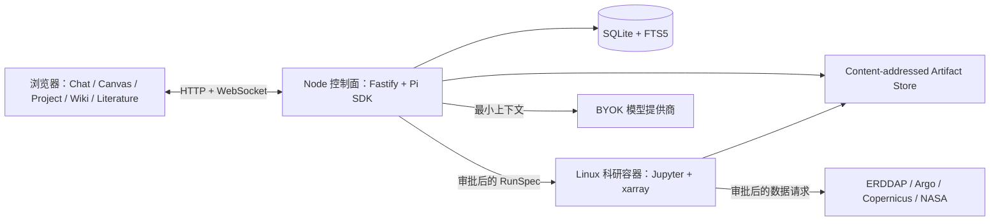
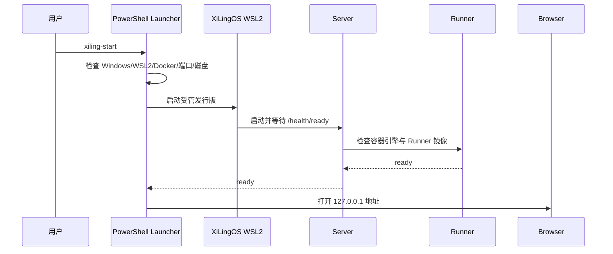

# 跨平台部署与 Windows/WSL2 设计

## 逻辑部署



## 平台映射

| 平台 | Web/Server | Runner | 活动数据 | 用户文件交换 |
|---|---|---|---|---|
| macOS | 本机 Node | Linux 容器 | 应用数据目录 | Finder 导入/导出 |
| Linux | 本机 Node | Linux 容器 | XDG 数据目录 | 本地目录导入/导出 |
| Windows 11 | WSL2 内 Node | WSL2/Linux 容器 | WSL ext4 | NTFS 一次性导入/导出 |

## Windows 启动序列



## Windows 数据目录

```text
\\wsl.localhost\XiLingOS\home\xiling\
├── projects/      # 项目元数据与工作目录
├── artifacts/     # SHA-256 内容寻址文件
├── cache/         # 可安全重建的缓存
├── database/      # SQLite WAL
├── credentials/   # AES-256-GCM 密文与独立主密钥，不进入项目备份或 Agent 上下文
└── logs/          # 截断、脱敏后的诊断日志
```

## 导入与导出

1. 浏览器或 PowerShell 接收 Windows 源路径。
2. Path Bridge 检查 UNC、OneDrive 占位、junction、非法名、大小写冲突和磁盘空间。
3. 源文件通过 `/mnt/<drive>` 只读读取，一次性复制到 WSL 暂存区。
4. 计算 SHA-256，原子移动到 Artifact Store。
5. 数据库只保存 `artifact://<sha256>` 等资源 URI；原始路径仅作为审计元数据。
6. 导出时生成安全文件名并复制回用户选定的 NTFS 目录。

首版不把 UNC/SMB、OneDrive 占位文件或 `/mnt/c` 目录直接挂进科研容器。

## 安全与取消

- Server 只绑定 `127.0.0.1`，不自动增加 Windows 防火墙规则。
- Runner 输入只读、工作目录可写、网络默认关闭，并设置 CPU/内存/时间上限。
- 模型取消使用 Pi `abort()`；Python 使用 Jupyter interrupt；容器使用 Engine API；下载使用 `AbortSignal`。
- 正常停止不依赖 POSIX `SIGTERM`；强制终止仅作为超时升级路径。
- 凭据不写入 SQLite、日志、会话或 Artifact；Windows/WSL2 的持久化方案在 Gate 2 安全 spike 中验证后确定。
