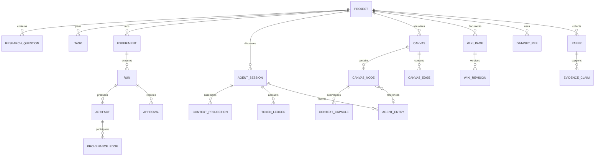

# 统一科研领域模型

## 聚合关系



## 稳定公共类型

`packages/contracts/src/index.ts` 是领域类型的唯一事实源，`packages/api-contracts/src/index.ts` 是 HTTP 运行时校验的唯一事实源。文档不再复制整套可漂移的接口；当前关键边界如下：

```ts
export type ResourceUri =
  | `project://${string}`
  | `artifact://${string}`
  | `dataset://${string}`;

export type CanvasEdgeKind = "follow-up" | "quote" | "produced" | "checkpoint";

export interface CanvasGraphDocument {
  version: 2;
  revision?: number;
  nodes: CanvasLayoutNode[];
  edges: CanvasEdge[];
}

export interface ContextProjection {
  activeBranchNodeIds: string[];
  quotedNodeIds: string[];
  capsules: ContextCapsule[];
  artifactUris: ResourceUri[];
  activatedCapabilities: string[];
  projectionHash: string;
}

export interface ContextCapsule {
  id: string;
  sourceNodeId: string;
  sourceRevision: string;
  summary: string;
  claims: string[];
  artifactUris: ResourceUri[];
  layer?: "node" | "branch"; // branch 仅用于旧数据兼容，不再生成或参与组装
  coveredNodeIds?: string[];
}
```

## 关键不变量

- 所有对象属于一个 `Project`；跨项目引用必须显式复制或建立只读引用。
- Chat、画布、Wiki 和项目管理不复制 Artifact，只引用同一 `artifact://` URI。
- Agent Session 是追加式执行事实；Canvas 是用户可编辑科研语义图，两者通过稳定 source entry 映射而不是 1:1 镜像。
- Canvas `body` 和 Wiki 摘要都是展示/知识表达，不是 Agent 原始消息事实源；完整来源必须经 `SourceContentResolver` 按 entry/domain URI 获取。
- `Run` 一旦完成，输入、代码、环境和输出 manifest 不可原地修改；重跑产生新 Run。
- Wiki 正式版本保留不可变历史；Agent 只能提交带 source entry/run/evidence 溯源的草稿或差异，用户确认后才能发布。Canvas 当前使用 revision 防止并发静默覆盖。Agent Patch 的完整预览/确认/撤销历史仍是后续独立能力，不能与布局保存混为一谈。
- 外部绝对路径只存在于导入审计记录，不作为业务对象主键或运行输入。
- 对话压缩摘要不是证据源；EvidenceClaim 必须指向论文片段、数据或 Artifact。
- `follow-up` 边定义对话分支；Follow-up 只投影锚点的祖先链，不扫描整个画布。
- `quote` 边表示用户显式跨分支引用；多个父上下文通过新的合成节点汇合，不改写原分支。
- Context Capsule 是可失效的派生缓存，不是事实源；任何结论仍需回链到原节点或 Artifact。
- 只有 node Capsule 参与当前组装；旧 branch Capsule 生成路径已删除，因为它曾影响哈希却没有进入模型上下文。

## 首版状态机

```text
Task:       backlog -> ready -> running -> blocked | done
Experiment: draft -> approved -> running -> reviewing -> accepted | rejected
Run:        queued -> running -> succeeded | failed | cancelled
Approval:   pending -> approved | rejected | expired
Artifact:   staging -> verified -> available | quarantined
```
