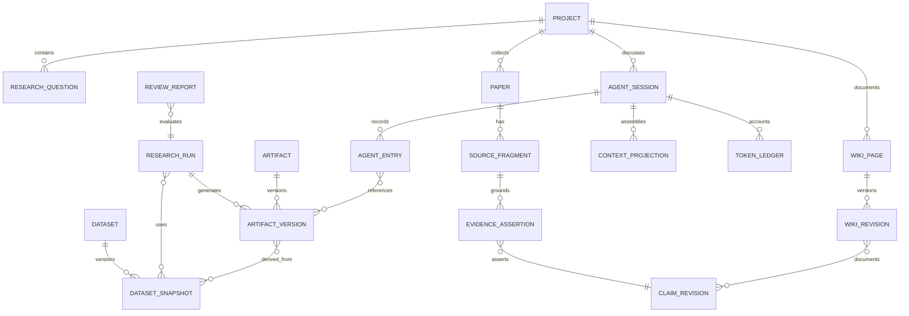

# 统一科研领域模型

## 聚合关系



## 稳定公共类型

`packages/contracts/src/index.ts` 是领域类型的唯一事实源，`packages/api-contracts/src/index.ts` 是 HTTP 运行时校验的唯一事实源。文档不再复制整套可漂移的接口；当前关键边界如下：

```ts
export type ResourceUri =
  | `project://${string}`
  | `artifact://${string}`
  | `dataset://${string}`;

export type ResearchRelationKind =
  | "CITES" | "ASSERTS" | "BASED_ON"
  | "USED" | "GENERATED" | "DERIVED_FROM"
  | "EVALUATES" | "DOCUMENTS" | "SUPERSEDES";

export interface ResearchGraphEntity {
  id: string;
  projectId: string;
  kind: ResearchEntityKind;
  contentHash: string;
  revision: number;
}

export interface ContextProjection {
  activeBranchNodeIds: string[];
  quotedNodeIds: string[];
  capsules: ContextCapsule[];
  artifactUris: ResourceUri[];
  activatedCapabilities: string[];
  projectionHash: string;
}

export interface ContextCapsule {
  id: string;
  sourceNodeId: string;
  sourceRevision: string;
  summary: string;
  claims: string[];
  artifactUris: ResourceUri[];
  layer?: "node" | "branch"; // branch 仅用于旧数据兼容，不再生成或参与组装
  coveredNodeIds?: string[];
}
```

## 关键不变量

- 所有对象属于一个 `Project`；跨项目引用必须显式复制或建立只读引用。
- Chat、科研画布、Wiki 和项目管理不复制 Artifact，只引用同一 `artifact://` URI。
- Agent Session 是追加式执行事实；Chat 内 Agent Execution Graph 是它的查询投影。Scientific Canvas 是 Research Graph 的查询投影，两种图不能互相冒充事实源。
- Scientific Canvas 节点坐标、视口和折叠状态只属于 Layout Store；Research Graph 保存科研实体和类型化关系，不保存布局。
- Wiki 摘要和画布展示文本不是 Agent 原始消息或科研证据；完整来源必须经 `SourceContentResolver` 按 entry/domain URI 获取。
- `Run` 一旦完成，输入、代码、环境和输出 manifest 不可原地修改；重跑产生新 Run。
- Wiki 正式版本保留不可变历史；Agent 只能提交带 source entry/run/evidence 溯源的草稿或差异，用户确认后才能发布。Agent 生成的 ResearchGraphChangeSet 同样必须先预览、再确认；布局保存不等同于科研事实审批。
- 外部绝对路径只存在于导入审计记录，不作为业务对象主键或运行输入。
- 对话压缩摘要不是证据源；EvidenceAssertion 必须通过 `BASED_ON` 指向 SourceFragment、DatasetSnapshot 或 ArtifactVersion，再通过 `ASSERTS` 指向 ClaimRevision。
- `follow-up` 与 `quote` 只属于已经退役的旧 Gate 3 快照类型，不再驱动正式 Chat、Scientific Canvas 或科研证据关系。Chat 现在保存 Research Graph active entity 与显式引用；Agent Execution Graph 使用 `contains/started/continued/invoked/returned/produced/compacted` 描述耐久执行事实。
- Context Capsule 是可失效的派生缓存，不是事实源；任何结论仍需回链到原节点或 Artifact。
- 只有 node Capsule 参与当前组装；旧 branch Capsule 生成路径已删除，因为它曾影响哈希却没有进入模型上下文。

## 首版状态机

```text
Task:       backlog -> ready -> running -> blocked | done
Experiment: draft -> approved -> running -> reviewing -> accepted | rejected
Run:        queued -> running -> succeeded | failed | cancelled
Approval:   pending -> approved | rejected | expired
Artifact:   staging -> verified -> available | quarantined
```
