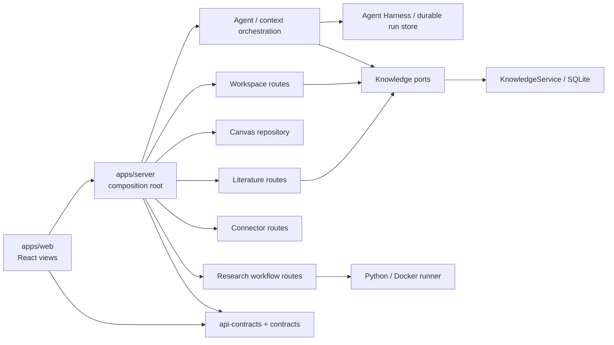

# 模块化单体架构

## 目标

汐灵 OS 当前采用模块化单体，而不是提前拆成微服务。Web、Agent 编排、项目知识库与本地科研执行仍可一次启动，但模块间只能经公共契约和窄接口协作。这样保留个人科研软件的安装与调试体验，同时允许未来把 Runner、文献检索或连接器独立部署。

## 包依赖方向

- `contracts` 是无运行时依赖的领域类型核心。
- `api-contracts` 依赖 `contracts`，提供前后端共用的 Zod 运行时校验。
- `context`、`credentials`、`literature`、`connectors`、`knowledge`、`agent-harness` 和 `pi-runtime` 只依赖允许的下层包。`agent-harness` 不依赖 Pi，由 Server 在组合根注入 `PiRuntimeAdapter`。
- `research` 是 Gate 3 兼容聚合，不得被新模块继续扩展。
- `apps/server` 是组合根；允许装配所有模块，但业务模块不得反向导入应用层。
- `apps/web` 通过 HTTP/SSE 契约访问服务端，不导入服务端实现。
- 所有 `@earendil-works/pi-*` 依赖只能出现在 `pi-runtime`；Server 依赖 `PiCompatibilityPort` 和汐灵运行类型。

`pnpm architecture` 会静态检查 workspace 包依赖方向和 Pi 反腐层；`pnpm pi:compat` 额外检查 Pi 版本锁步与核心行为。新增跨包依赖必须先更新 ADR 和检查规则。

## 服务端模块边界

| 模块 | 责任 | 可替换边界 |
|---|---|---|
| `workspace` | Project、事项、Chat 目录/迁移读取、Wiki HTTP API | `ProjectStore`、`ConversationStore`、`WikiStore` |
| `canvas` | 图文档、原子写入、修订冲突、布局 API | `CanvasRepository` |
| `literature` | 搜索、证据固定、论文入画布 | `LiteratureSearchService`、`EvidenceStore`、`CanvasRepository` |
| `connectors` | 元数据、审批任务、下载、Artifact 读取 | `ConnectorMetadataProbe`、`ConnectorWorkflowService` |
| `workflows` | 项目科研闭环状态机 HTTP API | `ProjectWorkflowService` 与 settlement 回调 |
| `settings` | 凭据状态、模型路由、自定义 Provider | `CredentialStore`、`ModelRuntimeStore` |
| `agent-center` | Chat/Canvas command、snapshot、event、source resolution 主 API | `ResearchAgentHarness`、`SqliteAgentSessionStore`、`HarnessRuntimeFactory` |
| `legacy-gate3` | 旧 Gate 3 路由兼容 | 只维护，不增加能力 |

跨模块的“Workflow 完成后写入实验、Wiki、画布”属于应用层 settlement。它显式调用三个端口，保持幂等，不下沉到任何单一存储模块。

## 数据一致性

- SQLite 由顺序迁移器管理，版本保存在 `PRAGMA user_version`；应用拒绝打开比自身更新的数据库。Knowledge 与 Agent run 使用两个同进程 SQLite 文件，用于隔离领域事实与追加式执行事实，不引入网络服务或分布式事务。
- KnowledgeService 是当前适配器；调用方使用按能力拆分的 ports，不依赖整个实现类。
- Knowledge 拥有 Chat Session 目录；Agent Store 拥有消息、工具、Run、Usage 和 Compaction。Canvas 仅保存 `sourceEntryId/runId` 与可编辑展示摘要。
- Workflow Store 拥有审批状态机；Server Host 的 projector 只消费已落盘的 Agent tool result，使用稳定投影键创建 `draft`，再把独立 projection event 追加回 Agent Store。启动 reconcile 负责关闭跨存储崩溃窗口。
- Canvas 使用项目级文档、单调 `revision`、乐观并发控制、项目内串行写队列与临时文件原子替换。
- Artifact 和科研大数据不写入 SQLite，也不复制到模型上下文；业务对象只保存受管 URI。

## 前端基础设施

- `api-client.ts` 统一 JSON 请求、错误类型与序列化。
- `agent-stream.ts` 统一增量 SSE 解码，正确处理跨 chunk JSON 与末尾事件。
- `research-session-client.ts` 统一 Chat 和画布的 Agent command、取消和耐久事件订阅；不持久化消息，不写 Workflow。
- 视图组件只处理交互与局部状态；新视图不得复制 fetch/SSE/工作流协议。

## 演进规则

1. 新能力先在现有模块中增加端口和适配器。只有当数据拥有者、迁移节奏和写入模式显著不同时才允许独立数据库，并必须由 ADR 和恢复测试证明必要性。
2. 当模块确实需要独立扩缩容、故障隔离或远程部署时，再把端口实现迁出进程。
3. 不以“未来可能需要”为理由预先引入消息总线、分布式事务或微服务。
4. MCP 连接管理位于独立 Host；Server 只持有配置与单代理工具，完整 MCP schema 不常驻上下文，Extension 不进入主进程。
