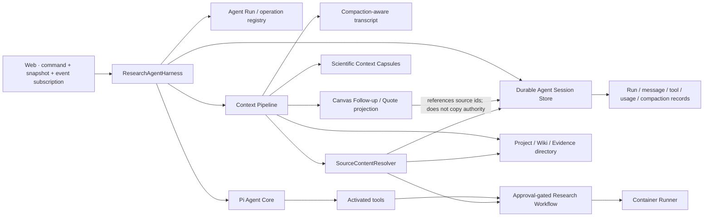

# Gate 4.5：Agent 中枢架构纠偏

> 当前状态：4.5-A/B/C/D 均已实现并由用户确认。第 1–8 节保留为立项时的问题与目标基线，当前代码事实以第 9 节、`DESIGN.md` 和契约为准。

> 完成日期：2026-08-25
> 后续状态：Gate 5 Beta 发布候选已启动
> 提议决策：[ADR 0022：Research Agent Harness](adr/0022-research-agent-harness.md)

## 1. 为什么必须增加本 Gate

当前系统保留了 Pi `Agent` 的模型流、工具循环、参数校验、事件和 `abort()`，也实现了有价值的画布分支投影、按需 Skill/tool 与科研 Context Capsule。但是，本应由 Agent Harness 统一负责的会话、运行、工具记录、压缩、断线恢复和结果持久化分别散落在 Web、Fastify Chat 路由、Knowledge SQLite、Canvas JSON 与进程内对象中。

这会造成四个不可继续带入 Gate 5 的问题：

1. 每个 HTTP 请求新建短命 Agent，运行没有持久身份和单写者协调。
2. Web 在 SSE 完成后保存回答并把工具结果转成 Workflow，断线可能丢失已完成结果。
3. 当前 `transformContext` 只做相邻消息去重，没有 Pi 式 Compaction；科研 Capsule 被迫承担不属于它的对话压缩责任。
4. Canvas 节点保存展示截断文本，却可能被当成完整消息来源，存在上下文真实性缺口。

Gate 4.5 的目标不是推倒现有产品，而是建立一个服务端拥有、可恢复、可观测的 `ResearchAgentHarness`，把 Pi 通用内核与汐灵科研领域清晰分层。

### 产品语义保护线

| 产品面 | Gate 4.5 保留什么 | 只替换什么 |
|---|---|---|
| Chat | 项目内对话、流式回答、工具可见性、取消/重试 | Agent session/run/message/tool/usage 的权威写入改由 Server 负责 |
| 科研画布 | Follow-up、Quote、Free Node、自由拖动和用户可编辑科研语义图 | 节点用稳定 source ID 回取完整来源；展示正文不再冒充运行历史 |
| Wiki | 两栏项目百科、不可变修订、链接/反链、Artifact 浏览 | Agent 仅提交带溯源的草稿/差异，并继续经过用户确认 |
| Evidence/Workflow | 独立领域对象、审批和科研溯源 | Harness 只协调调用与记录引用，不接管领域事实 |
| Context | 活动分支、显式 Quote、Capsule、懒加载工具/Skill、Artifact URI | 加入 transcript compaction、统一来源解析和分层预算 |

`ResearchAgentHarness` 是运行协调者，不是 Canvas、Wiki、Evidence、Workflow 或 Artifact 的领域仓库。任何实现若把这些对象并入 Pi session 作为唯一表示，即视为偏离本 Gate。

## 2. 事实基线

### 已经真实具备

- Pi `Agent` 的 provider stream、工具循环、工具参数校验、并行/串行执行和事件订阅。
- 每轮按 Capability 命中后激活工具，Skill 正文按需加载。
- Canvas Follow-up/Quote 投影、旧节点 Capsule、近期节点原文策略和组装缓存。
- Project、Chat、Wiki、Evidence 的 SQLite 持久化。
- Workflow 审批、Connector、Runner、Reviewer、Artifact 和 settlement。

### 尚未真实具备

- 可用的 Pi `AgentHarness` 运行闭环。固定的 `pi-agent-core@0.84.2` 虽导出 Harness/Session/Compaction，但 `AgentHarness` 的主要运行方法仍不可用。
- 服务端持久 Run、operation log、断线重连、活动回合恢复和跨请求 steering/follow-up。
- 自动对话 Compaction、CompactionEntry、retained tail 和全回合 usage。
- Server 对 Agent 最终消息和工具业务结果的原子/幂等持久化所有权。
- Canvas 展示摘要到完整消息、工具记录和 Artifact 的无损引用链。

## 3. 本 Gate 的边界

### 必须完成

- 统一 Agent 中枢接口、数据所有权和生命周期。
- 保留 Pi 通用 Agent 内核，补齐当前版本未提供的宿主协调层。
- 把对话 Compaction 与科研 Capsule 分开。
- 把消息、工具结果、usage 与 Run 状态的权威写入移到 Server。
- 支持取消、客户端脱离、重新订阅和服务重启后的确定性恢复。
- 修复模型输出能力上限被误当成本轮输出预算的问题。
- 迁移旧 Chat/Canvas 数据且不破坏现有项目。

### 明确不做

- 本 Gate 原始范围不接入 MCP；该历史边界已在 Gate 4.5-D 确认后由 [ADR-0024](adr/0024-isolated-pi-mcp-host.md) 的独立 Host 方案替代。
- 不引入微服务、消息总线或云端多租户。
- 不复制 Pi Coding Agent 的 TUI、CLI、系统提示或通用 Bash/写文件工具。
- 不把 Canvas 变成 Pi Session Tree 的 UI 镜像。
- 不用摘要替代论文、数据、日志或 Artifact 原始证据。
- 不在设计确认前改写正式 Chat 主路径。

## 4. 目标架构



### 单一事实源

| 数据 | 权威所有者 | Canvas 中的表示 |
|---|---|---|
| Agent message / tool call / compaction / run | Durable Agent Session Store | `sourceEntryId` / `runId` 引用与展示摘要 |
| Project / Wiki / Evidence / Task | Knowledge SQLite | 领域对象 URI 或 ID |
| Canvas 位置和科研语义边 | Canvas Repository | 自身权威 |
| Workflow / approval / run | Project Workflow | `workflowId` 与 Artifact URI |
| 大文件与计算输出 | Artifact Store / RO-Crate | Artifact URI |

Pi Session Tree 记录“Agent 实际发生了什么”；Canvas 表达“研究者选择如何组织和理解这些内容”。两者必须通过稳定 ID 映射，不能互相复制后竞争权威。

Canvas 与 Pi Session Tree **不是 1:1 映射**：一个 Canvas 节点可以引用一个 Agent entry、Artifact、Paper/Evidence、Workflow 或自由笔记；一个 Agent entry 也可以不被投影、被多个节点引用，或在用户确认后投影到 Wiki。节点位置、手工连线和自动布局永远不改变 Agent 执行历史。

## 5. Pi 内核保留策略

### 必须直接复用

- `pi-ai` provider、模型协议、流式传输、原生模态和 usage。
- Pi `Agent`/Agent Loop、工具调用解析、参数校验、执行模式和事件生命周期。
- `beforeToolCall`、`afterToolCall`、`shouldStopAfterTurn`、abort、steer、follow-up。
- Pi AgentMessage、Skill loader、Compaction primitives、Session/Entry 类型和 telemetry vocabulary。

### 汐灵实现宿主适配

- `ResearchAgentHarness`：项目作用域、运行所有权、订阅、取消与恢复。
- `AgentSessionStore`：把 Pi entry/run/compaction 语义映射到耐久存储。
- `ResearchContextPipeline`：组合对话 transcript、Canvas 投影、领域目录和 Artifact 引用。
- `CapabilityResolver`：在宿主侧选择本轮工具/Skill，不把完整目录放入模型。
- `AgentResultProjector`：把已持久化结果按确认规则投影到 Canvas、Wiki、Task 或 Workflow。
- `SourceContentResolver`：根据 source kind 和稳定 ID 无损解析 Chat Entry、Paper/Evidence、Workflow、Artifact 或自由笔记；Context Pipeline 不直接读取 Canvas 展示文本推断原文。

### 暂不直接采用 `AgentHarness` 类

Gate 4.5 技术样例必须比较以下两条路径：

1. 在当前 `pi-agent-core@0.84.2` 上复用可工作的 `Agent`、Session 与 Compaction primitives，建立薄宿主协调层。
2. 若升级后的 Pi Harness 已通过 API、耐久性、Windows/WSL 和迁移验证，则直接适配稳定 Harness。

在样例与依赖评估完成前，不凭文档中的目标设计假设上游能力已经可用，也不 Fork Pi 内核。

## 6. 上下文与压缩分层

```text
稳定系统规则与项目身份
    ↓
当前用户问题 + 活动画布锚点/Quote
    ↓
Pi Compaction-aware Transcript
    ↓
较早科研节点的结构化 Capsule
    ↓
按需工具 / Skill schema
    ↓
Artifact、论文、数据的目录与局部读取结果
```

必须遵守：

1. Pi Compaction 只压缩对话、工具轨迹和临时推理，不取代科研证据。
2. Scientific Capsule 保存目标、约束、决策、未解决问题、声明和证据 URI，不再只抽取首/中/末句。
3. 最近活动节点通过 `sourceEntryId` 回取完整消息；Canvas `body` 只是展示摘要。
4. 每个 provider 请求前、每个工具继续回合前都重新估算上下文。
5. “模型最大输出能力”与“本轮自适应输出预算”分离，使用同一个实际预算组装上下文和调用 provider。
6. Compaction 必须记录覆盖范围、保留尾部、来源哈希、模型、usage 和原因。
7. 超出窗口时先压缩对话、复用 Capsule 和局部读取；仍无法保持证据完整才显式失败。
8. Wiki、Evidence 与 Artifact 默认只把目录、URI 和检索命中片段送入上下文，不把整个项目知识库常驻注入。
9. 只保留会进入 Context Assembler 的 node Capsule；旧 branch Capsule 因只生成不消费，已在 4.5-D 删除生成与哈希路径。

## 7. 拟建立的稳定端口

以下是责任边界，不是最终字段冻结：

```ts
interface ResearchAgentHarness {
  startTurn(command: StartAgentTurn): Promise<AgentRunHandle>;
  cancel(runId: string): Promise<AgentRunSnapshot>;
  resume(runId: string): Promise<AgentRunSnapshot>;
  snapshot(runId: string): Promise<AgentRunSnapshot>;
  subscribe(runId: string, afterSequence?: number): AsyncIterable<AgentRunEvent>;
}

interface AgentSessionStore {
  acquireWriter(sessionId: string): Promise<SessionWriterLease>;
  appendOperation(record: AgentOperationRecord): Promise<void>;
  appendEntry(entry: AgentSessionEntry): Promise<void>;
  appendCompaction(record: AgentCompactionRecord): Promise<void>;
  loadContext(sessionId: string, branchId: string): Promise<CompactionAwareContext>;
}

interface ResearchContextPipeline {
  assemble(request: ResearchContextRequest): Promise<ResearchContextResult>;
  prepareNextTurn(state: AgentTurnState): Promise<ResearchContextResult>;
}

interface SourceContentResolver {
  resolve(ref: AgentSourceRef, options: SourceReadOptions): Promise<ResolvedSourceContent>;
}
```

`SourceContentResolver` 的实现必须进行项目作用域校验、类型/字节上限与来源完整性检查；不得接受任意操作系统绝对路径。

## 8. 数据兼容与迁移不变量

- 旧 `messageId` 与 Canvas `body` 原样保留；新增 `sourceEntryId`/domain URI，不在迁移时重写用户可见内容。
- 迁移顺序固定为：只读盘点 → dry-run 报告 → 备份 → dual-read → 小范围回填 → 完整性核验 → 可回滚切换。
- dual-read 期间优先解析新 source entry，缺失时回退旧 `messageId`；两者内容不一致时报告冲突，不静默选边。
- Wiki 的 Agent 草稿必须记录 `sourceEntryId`、`runId`、Artifact/Evidence URI 与生成时间；发布/覆盖仍需用户确认。
- Canvas/Wiki/Evidence 的领域主键不因 Agent session 迁移而变化。

## 9. 实施阶段与确认点

### 4.5-A：事实与技术样例

状态：**已完成，确认点 A 已通过。** 实测报告见 [Gate 4.5-A：Pi Session / Compaction / Harness 隔离样例](spikes/gate-4.5-a-pi-runtime.md)。

交付：

- Pi 0.84.2 实际可用 API 清单与上游稳定性评估。
- 当前 Pi primitives 路径与经验证上游 Harness 路径的比较；样例不连接正式 Chat。
- 数据所有权、非 1:1 Session/Canvas 映射、`SourceContentResolver` 与 schema/migration delta 草案。
- 输出预算、Compaction 和工具多回合测试 fixture。

**确认点 A：已于 2026-08-24 确认维持 `0.84.2`，采用当前 Pi primitives + 薄宿主 Harness。升级边界和 Package 分级兼容按 [ADR 0023](adr/0023-pi-upgrade-and-package-compatibility.md) 执行。**

### 4.5-B：服务端 Agent 中枢垂直切片

前置条件：**已完成。** Pi 直接依赖已收敛至 `@xiling/pi-runtime`，`pnpm pi:compat` 已建立；任意 Pi Extension 不进入 Server 进程。

实施状态：**已完成并确认。** 实现与证据见 [Gate 4.5-B 隔离垂直切片报告](spikes/gate-4.5-b-agent-center.md)。

交付：

- 耐久 session/run/operation/entry/usage 存储。
- 单写者、服务端消息落盘、工具事件落盘。
- snapshot + 可续传事件订阅。
- 正常取消、客户端脱离、重新订阅和服务重启恢复。
- 一个离线 Agent、多回合工具和 Compaction 样例。

**确认点 B：用户审查运行记录、恢复行为和上下文可见性；确认后才迁移正式 Chat/Canvas。**

### 4.5-C：上下文与 Canvas 无损迁移

实施状态：**已完成并确认。** 实现与验证见 [Gate 4.5-C 迁移报告](spikes/gate-4.5-c-context-migration.md)。用户已明确允许开发阶段的破坏性改造；实际实现仍保留了自动备份和旧 `messageId` 来源元数据，因为这不会增加运行时复杂度。

交付：

- Compaction-aware transcript 与科研 Capsule 双层机制。
- Canvas 节点引用完整 source entry，不再用展示截断文本冒充原文。
- 旧 Chat/Canvas/Capsule 数据迁移器、备份和 dry-run 报告。
- Chat 与 Canvas 共享同一服务端 Session/Run。

**确认点 C：用户批准迁移预览和回滚方案后，才允许写入现有项目数据。**

> 2026-08-24 范围修订：用户已授权开发数据直接迁移，因此实施不再以“先预览后写入”为阻塞条件；本确认点改为审查迁移后的实际 Chat/Canvas 行为、来源可见性与 Compaction 边界。

### 4.5-D：主路径切换与清理

实施状态：**已完成并确认。** 实现与验证见 [Gate 4.5-D 主路径所有权报告](spikes/gate-4.5-d-main-path-ownership.md)。

交付：

- Web 只发 command、读取 snapshot、订阅事件和请求取消；不再拥有 Agent 运行持久化。
- 删除 `/api/chat/stream`、旧消息 POST、模块级 retained message/run/abort Map；只保留旧消息 GET 与迁移读源。
- 原始 `tool.finished` 先落 Agent Store，Server Host 再创建审批草稿并追加独立 `workflow.projected` 事件；稳定投影键与启动 reconcile 关闭崩溃/恢复窗口。
- Workflow 动作和 Artifact 读取必须携带 `projectId` 并反查 Project/Chat Session 归属；批准绑定当前 request hash。
- 删除只生成、入库和影响 projectionHash、却未进入模型的 branch Capsule 死路径；保留真正参与上下文的 node Capsule。
- Harness 关闭会等待在途执行完成后再关闭 SQLite。

**确认点 D：通过全部门禁并由用户确认后，Gate 4.5 才完成；之后重新评估是否进入 Gate 5。**

## 10. 强制验收矩阵

| 场景 | 必须证明 |
|---|---|
| 普通对话 | 完整消息由 Server 持久化，刷新后恢复 |
| 多回合工具 | 每次模型调用、工具调用和结果有顺序记录，最终 usage 为全回合总和 |
| 工具失败 | `tool.failed` 与成功事件明确区分，Agent 可纠错 |
| 重复工具循环 | 重复签名、总时长和费用保护可终止失控循环 |
| 客户端关闭 | Run 按策略继续或取消，但结果不会因 Web 消失而丢失 |
| 用户取消 | Provider、工具和下载收到同一取消链，终态为 `cancelled` |
| Server 重启 | 未完成 operation 恢复为可解释的 suspended/resumable 状态 |
| 自动 Compaction | 触发后保留近期尾部，摘要带覆盖消息、usage 和来源哈希 |
| 科研证据 | Compaction/Capsule 不替代 Paper/Dataset/Artifact 原始来源 |
| Canvas Follow-up | 活动节点按 source entry 读取完整内容，兄弟分支不泄漏 |
| Canvas 自由编辑 | 移动、重排、删投影或手工连线不改变 Agent session tree |
| Wiki 草稿 | Agent 只生成带 source/run/evidence 溯源的差异；未确认不得发布 |
| 来源解析 | Chat/Evidence/Workflow/Artifact/Free Note 按稳定 ID 解析并通过项目权限校验 |
| 模型窗口 | `maxOutputTokens === contextWindow` 的模型不会被错误地判定为零输入 |
| Skill/tool | 无关正文/schema 不进入 provider 请求 |
| 并发 | 同一 session 单写者，不同 session 可并行 |
| 迁移 | 旧项目 dry-run、备份、升级、回滚和幂等重跑通过 |
| Windows | WSL2 重启、浏览器断连、中文项目和 LF/UTF-8 正常 |

## 11. Gate 完成标准

只有同时满足以下条件才可标记 Gate 4.5 完成：

- 四个确认点均由用户明确确认。
- 正式 Chat/Canvas 不再拥有 Agent 运行持久化责任。
- Pi 内核复用范围与未采用能力有 ADR 记录。
- 自动 Compaction、完整 usage、取消、断线、恢复和无损 Canvas 引用均有离线自动化测试。
- 旧数据迁移可预览、可备份、可回滚、可重复执行。
- `pnpm architecture`、`typecheck`、`test`、`smoke`、`compliance` 全部通过。
- Windows 代码级 smoke 通过；Gate 5 前仍需真实 Windows 11 + WSL2 专机验收。
- DESIGN 与代码事实一致，不再把未接入能力写成已完成。
